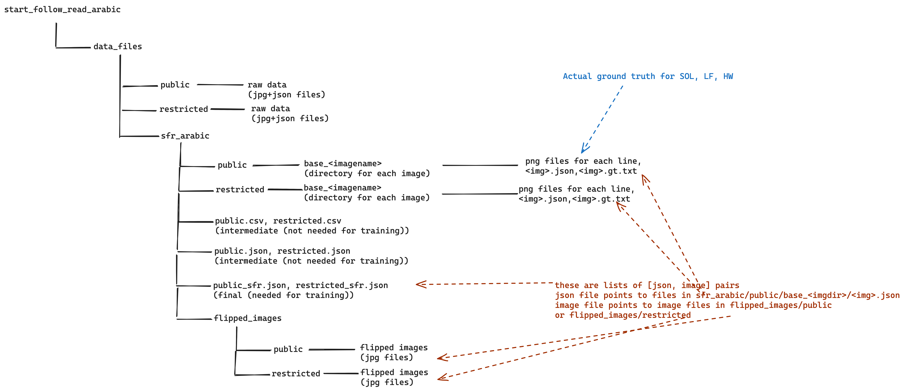

# Start, Follow, Read &mdash; Arabic
The code in this repository is modified from the source code: [Start, Follow, Read](https://github.com/cwig/start_follow_read) and its [Python3 version](https://github.com/sharmaannapurna/start_follow_read_py3). See their detailed paper:.
[Curtis Wigington, Chris Tensmeyer, Brian Davis, William Barrett, Brian Price, and Scott Cohen. Start, Follow, Read: End-to-end full-page handwriting recognition]. In Proceedings of the European Conference on Computer Vision (ECCV), pages 372–388, 2018. (https://openaccess.thecvf.com/content_ECCV_2018/html/Curtis_Wigington_Start_Follow_Read_ECCV_2018_paper.html)

We release this code under the same license as given as given on this page [Start, Follow, Read](https://github.com/cwig/start_follow_read).

You can use this code to train and test handwriting recognition (HTR) of Arabic historic manuscripts.

## Dataset
For the dataset, please see [Muharaf: Manuscripts of handwritten Arabic for cursive text recognition](https://github.com/MehreenMehreen/muharaf). 

## Setting up
1. Clone the repo
2. Setup the environment


## Preprocessing
The start, follow, read (SFR) system requires files in a specific format for training. You can download the preprocessed files for [Muharaf-public](https://zenodo.org/records/11492215). Make sure to extract them in the `main start_follow_read_arabic` directory.

In order to preprocess the files yourself, follow these steps:
1. Download the Muharaf-public dataset and place it in `data_files/public` folder in the `start_follow_read_arabic` directory.
2. On the command line, switch to the main `start_follow_read_arabic` directory. Activate the sfr environment.
3. From the command line run:
   ```
   python arabic/preprocessing_all.py ../data_files/public
   ```
Running this will create the following directory structure. You can ignore the restricted part, if you don't have these files. The system can be trained and tested witht the Muharaf-public part only:   

### Directory structure
The preprocessed directory looks like this: 


